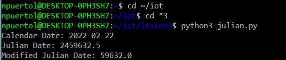
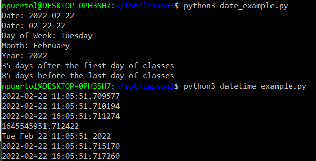
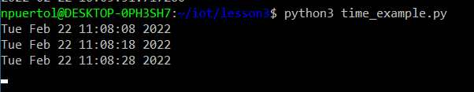
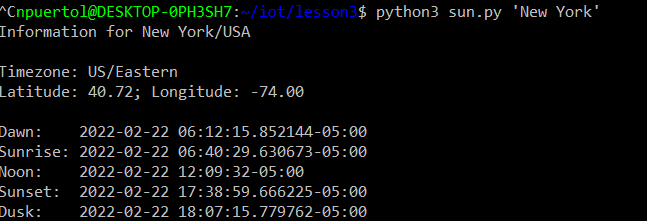
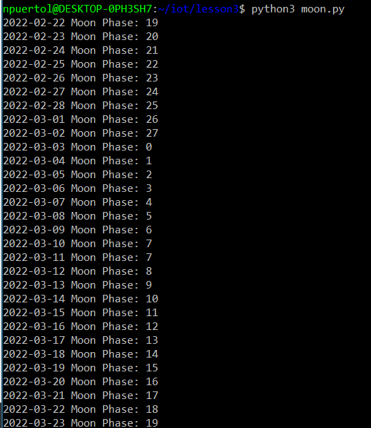
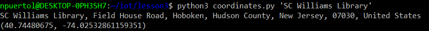
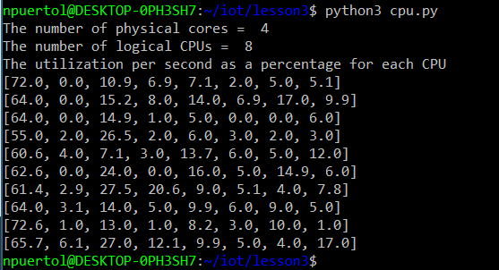
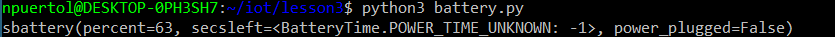
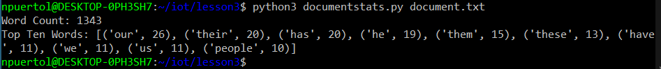

# Lab 3 - Python

Objective of Lab 3 was to install python and its libraries, then to run them in **WSL / Ubuntu** command line. 

**cd ~/iot, cd** ***3, and julian.py**  
  
**date_example.py and datetime_example.py**  
  
**timexample.py**  
  
**sun.py**  
  
**moon.py**  
  
**coordinates.py**  
  
**address.py**  
  
**cpu.py**  
  
**battery.py**  
  
**documentstats.py**  
  

All finished!
