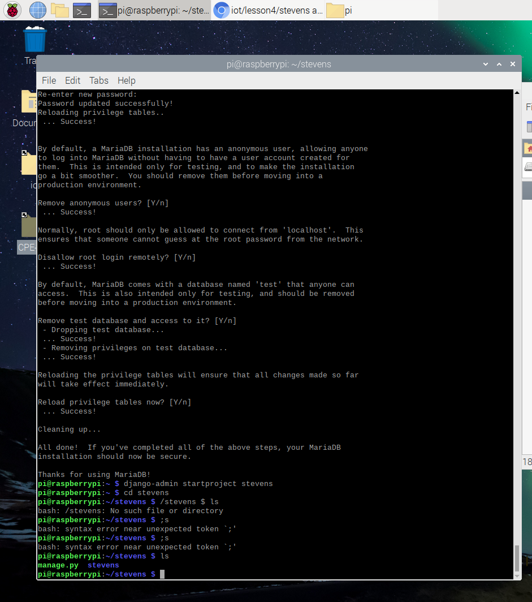

# Lab 4 - Django and Flask

Purpose of Lab 4 was to install Django and Flask in order to run servers/virtual environments for web applications.

**pip3 -V**  
  

**pip3 list**  
  

**install setuptools**  
  

**install django**  
  

**install django rest framework**  
  

**install django-filter**  
  

**install markdown**  
  

**install requests**  
  

**sudo apt update**  
  

**install mariadb-server mariadb-client**  
  

**install python3-mysqldb**  
  

**install mysqlclient**  
  

**sudo mysql_secure_installation**  
  

**Start django project stevens**  
  

**Create MySQL database**  
  

**Copy urls.py to ~/stevens/stevens**  
  

**Copy admin.py, models.py, and views.py to ~/stevens/myapp**  
  

**Copy index.html**  
  

**Run Django server, then login with django credentials**  
  

**View app at http://127.0.0.1:8000**  
  

****  
  

****  
  

****  
  

****  
  

****  
  
