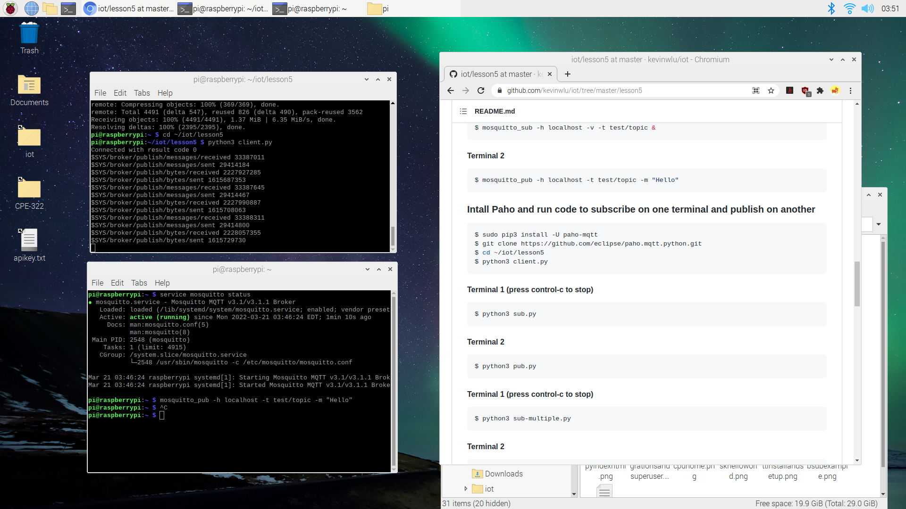
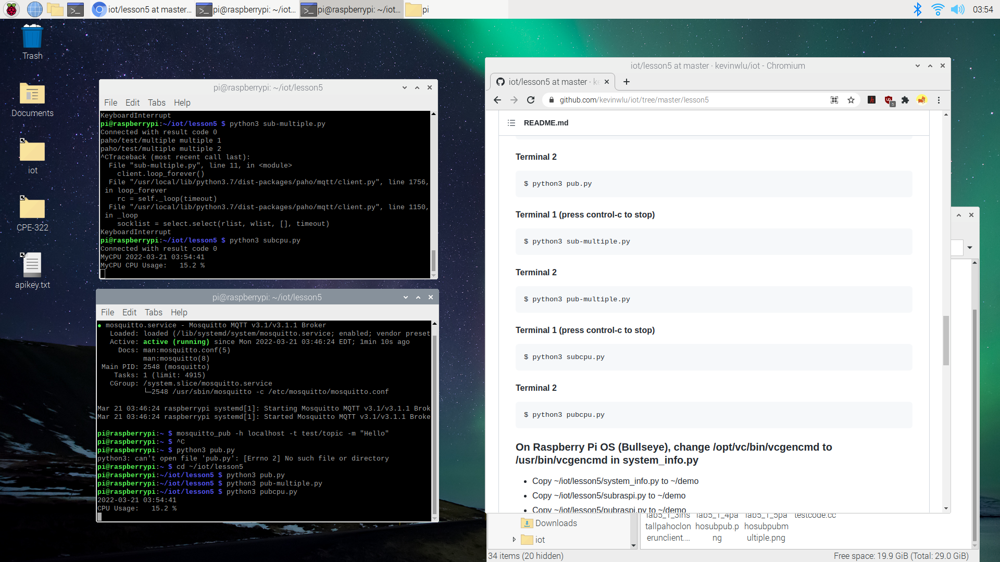

# Lab 5 - Paho MQTT

Objective of Lab 5 was to install Paho-MQTT, using it to demonstrate a subscriber-publisher model using CPU data in real-time.

**sudo pip3 install -U paho-mqtt, git clone, cd ~/iot/lesson5, then run client.py**
  

**running subcpu.py and pubcpu.py**
  

