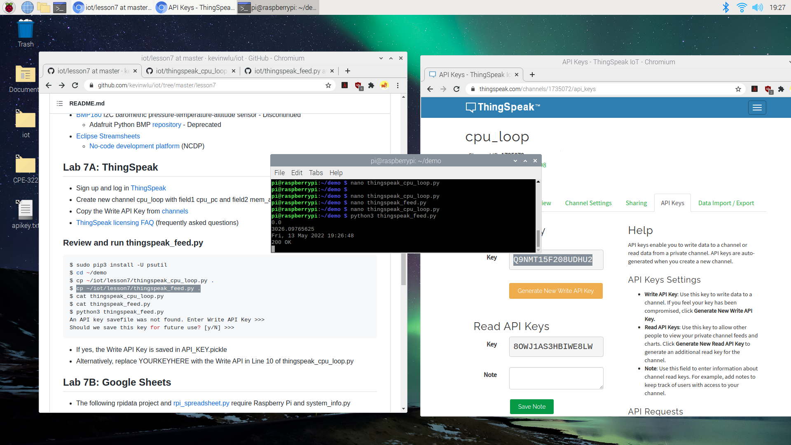

# Lab 7 Cloud Platforms

The goal of Lab 7 was to use cloud platforms such as ThingSpeak and APIs such as gspread to display datafeeds visually and on Google Sheets.

## Lab A: ThingSpeak
**Creating New ThingSpeak Channel**
 

**Running thingspeak_feed.py**

**Displaying Feed on ThingSpeak**

## Lab B: Google Sheets
**Running rpi_spreadsheet.py**

**Displaying published results on Sheets**

Lab 7 Finished
