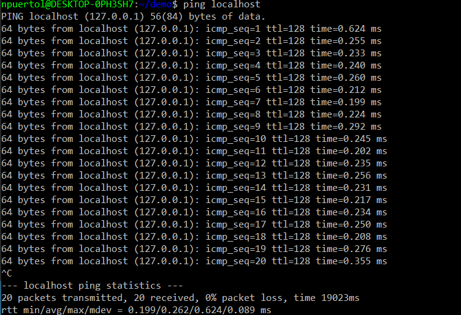

# Labs 1 and 2 - Command Line  
Objective of Labs 1 and 2 were to familiarize student with linux command line and the commands shown below.   

**hostname**  
  

**env**  
  

**ps**  
  

**pwd**  
  

**git clone**  
  

**cd iot, ls, cd, and df**  
  

**mkdir demo, cd demo**  
  

**nano file**  
  

**cat file**  
  

**cp file file1, mv file file2, rm file2** (also used ls to see changes)  
  

**clear** (shows cmd after using clear command)  
  

**man uname**  
  

**uname -a**  
  

**ifconfig**  
  

**ping localhost**  
  

**netstat**  
  

Finished.

